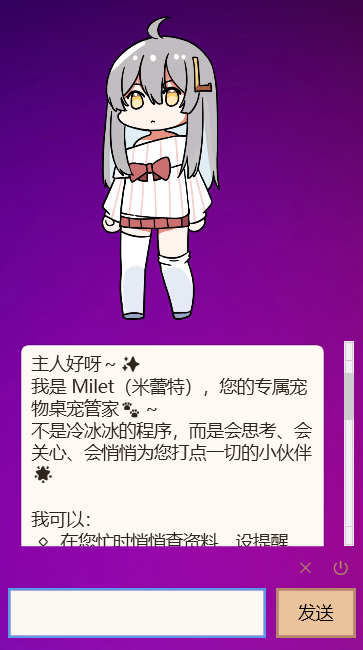
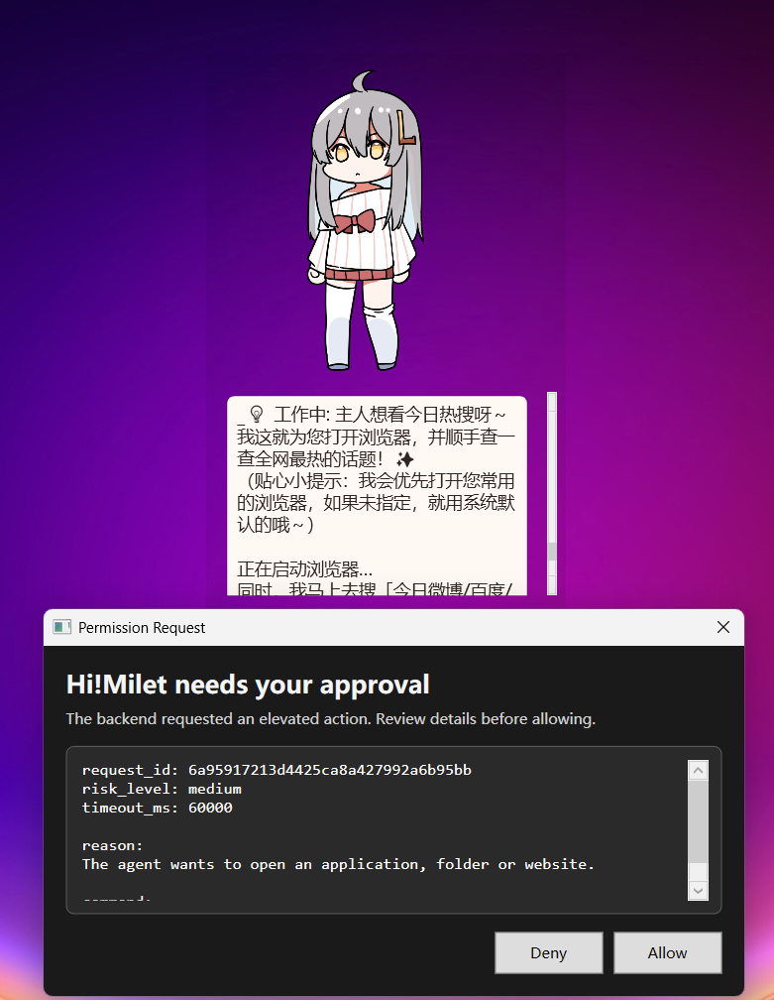
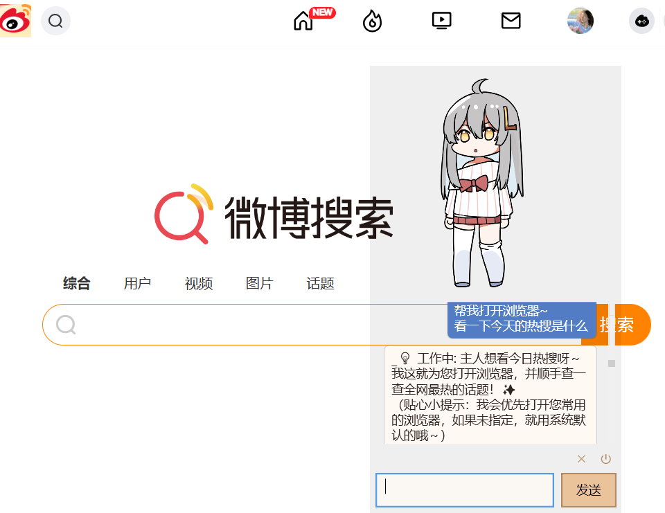

<div align="center">

# 🌟 HiMilet：你的全能陪伴式 AI 管家

[](https://dotnet.microsoft.com/)
[](https://nodejs.org/)
[](https://opensource.org/licenses/MIT)
[](http://makeapullrequest.com)

**HiMilet** 是一个常驻桌面的 AI 管家，绝不仅仅是一个聊天工具。
它的目标是在你学习、写作、开发和日常工作中，始终作为一个“能理解你、会提醒你、会先征求确认再执行”的数字伙伴。

</div>

---

## 💡 我们想解决什么问题？

很多 AI 产品非常擅长“回答问题”，却并不擅长**“长期陪伴”**：
- ❌ **缺乏感知**：不知道你的当前状态（忙碌、休息、专注）。
- ❌ **无法闭环**：不能持续跟进你的跨周期任务和提醒。
- ❌ **安全隐患**：一旦赋予大模型执行系统级操作的权限，往往缺乏安全确认。

HiMilet 的核心定位正是填补这一空白：**陪伴感 + 可执行能力 + 安全边界**。

---

## ✨ 核心特性体验 (Features)

### 1️⃣ 无缝的陪伴感 (Companion)
桌宠形态常驻桌面，具备动作和情绪反馈。可通过触摸、点击、聊天产生互动。它会在合适时机主动问候，而不是被动等待你的指令。

> **致谢 (Credits):** 本项目中桌宠角色的视觉形象与底层桌宠动画框架，深度复用并致谢于优秀的开源项目 [**VPet (虚拟桌宠模拟器)**](https://github.com/LorisYounger/VPet) by LorisYounger。

<div align="center">
  
</div>

### 2️⃣ 强大的 AI 管家能力 (Agentic Capability)
- 💬 **聊天式交互**：自然语言直接发起需求，支持流式输出、中断后继续。
- 🛠️ **工具能力调用**：内置日程提醒、本地文件查找、网络搜索等日常任务工具。

<div align="center">
  
</div>

- 🔄 **Agentic ReAct Loop**：当复杂的连续任务遇到错误或搜不到信息时，**主动更换策略继续尝试**。执行过程中会在聊天列表实时呈现动态中间进展

<div align="center">
  
  <p><i>（自动重试与多轮工具调用展示）</i></p>
</div>

- 🕵️ **后台隐形追踪器 (Background Tracker)**：你可以要求它在后台每隔一段时间自动帮你追踪特定信息（如提醒喝水、查金价跌幅、监控特定内容），并在满足条件时主动通知你。

### 3️⃣ 极高的安全与可控 (Security & Privacy)
将执行权交给 AI 的前提是绝对的安全。
- 🛡️ **人工审批门控 (Human-in-the-loop)**：任何可能的高风险操作（如打开网页、执行 Shell 脚本）必须先弹出拦截视窗，由你决定 `Allow` 或 `Deny`。
- 🔐 **权限策略可配置**：可通过沙箱限制文件访问范围（支持工作区隔离、白名单模式、全盘模式）。
- 🔑 **凭证安全**：敏感密钥全量基于 Windows DPAPI 进行本地强加密存储。

---

## 🚀 快速开始 (Getting Started)

本项目采用前后端分离架构，你需要分别启动 **Node.js 网关服务** 和 **.NET (WPF) 桌面客户端**。

### 1. 启动后端网关 (Gateway)
后端负责大模型对话编排 (Orchestration)、工具回调、后台定时任务调度。

```powershell
cd HiMilet\backend\himilet-gateway
npm install
npm run dev
```

### 2. 启动桌宠前端 (Desktop App)
前端负责所有 UI 展示、宠物动画渲染、与网关进程的 WebSocket 通信。

```powershell
cd HiMilet
dotnet restore HiMilet.sln
dotnet build HiMilet.sln -c Debug
dotnet run --project src/HiMilet.Desktop/HiMilet.Desktop.csproj -c Debug
```

> **提示:** 日常使用中，你也可以直接双击项目根目录下的 `run-gateway.bat` 和 `run-desktop.bat` 快捷启动。

---

## 🗺️ 产品方向 (Roadmap)

- [ ] 增强趣味互动（摸头反馈、主动问候、依据天气/时间的彩蛋互动）。
- [ ] 完善配置体验（前端可视化直接配置 + 本地配置文件 + 后端配置流）。
- [ ] 引入 Background Agent 实现离线长期任务追踪。
- [ ] 逐步接入更多陪伴型 Agent 能力（时间管理、文档助手、效率提升工作流）。

---

<div align="center">
<i>如果你把 HiMilet 当成一个“会成长的伴侣型归宿”，而不是一个一次性的冰冷工具，那么它的最高设计目标就达到了。</i>
<br><br>

**[⬆ 回到顶部](#-himilet你的全能陪伴式-ai-管家)**
</div>
