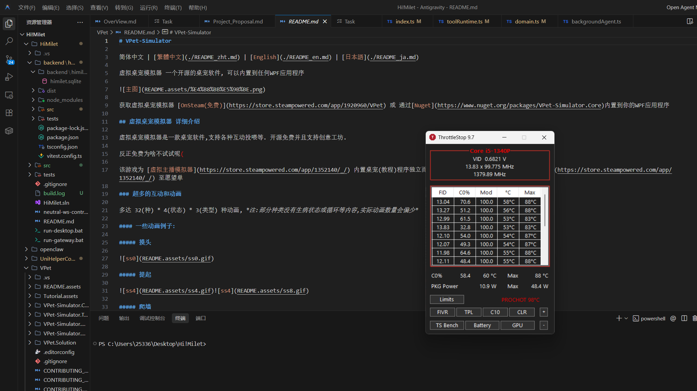

# HiMilet：陪伴式 AI 管家

HiMilet 是一个常驻桌面的 AI 管家，不只是聊天工具。  
它的目标是让你在学习、写作、开发和日常工作中，始终有一个“能理解你、会提醒你、会先征求确认再执行”的数字伙伴。

## 我们想解决什么问题

很多 AI 产品擅长“回答问题”，但不擅长“长期陪伴”：

- 不知道你的当前状态（忙碌、休息、专注）
- 不能持续跟进你的任务和提醒
- 执行系统级操作缺少安全确认

HiMilet 的定位是：**陪伴感 + 可执行能力 + 安全边界**。

## 产品体验（用户视角）

### 1) 陪伴感

- 桌宠形态常驻桌面，具备动作和情绪反馈
- 可通过触摸、点击、聊天产生互动
- 在合适时机主动问候，而不是被动等待指令

### 2) AI 管家能力

- 聊天式交互：自然语言直接发起需求
- 工具能力：如提醒、找文件等日常任务
- 可扩展 Agent：后续持续挂载更多能力模块

### 3) 安全与可控

- 高风险操作先弹出审批（allow/deny）
- 权限策略可配置（工作区、白名单、全盘）
- 敏感密钥本地加密存储（Windows DPAPI）

## 当前版本你可以做什么

- 与桌宠聊天（支持流式输出、中断后继续）
- 用聊天触发提醒和文件查找等工具
- **[新]** **Agentic ReAct Loop**：当复杂的连续任务遇到错误或搜不到信息时，主动换方法继续尝试，执行过程中会在聊天列表实时呈现中间进展。
- **[新]** **后台隐形追踪器 (Background Tracker)**：你可以要求它在后台每隔一段时间自动帮你追踪特定信息（如查金价跌幅、监控特定内容），并在满足条件时主动通知你。
- 在审批弹窗中确认或拒绝高风险操作
- 通过系统配置调整连接、权限和基础行为



## 快速开始（Windows）

### 启动网关

```powershell
cd HiMilet\backend\himilet-gateway
npm install
npm run dev
```

### 启动桌宠

```powershell
cd HiMilet
dotnet restore HiMilet.sln
dotnet build HiMilet.sln -c Debug
dotnet run --project src/HiMilet.Desktop/HiMilet.Desktop.csproj -c Debug
```

也可以直接双击：

- `run-gateway.bat`
- `run-desktop.bat`

## 产品方向（Roadmap）

- 让“投喂 / 面板 / 互动 / 系统”四类菜单都具备可用能力
- 增强趣味互动（摸头反馈、主动问候、彩蛋互动）
- 完善配置体验（前端直配 + 本地配置文件 + 后端配置）
- 逐步接入更多陪伴型 Agent 能力（提醒、文档、效率流）

## 常见问题

- 启动后看不到窗口：这是透明桌宠窗体，先检查 `HiMilet.Desktop` 进程是否在运行。
- 构建失败提示 DLL 被占用：先执行 `Stop-Process -Name HiMilet.Desktop -Force` 后重试。
- 聊天提示未配置 LLM：需要先配置可用的模型 profile 和密钥。

---

如果你把 HiMilet 当成一个“会成长的 AI 管家”，而不是一次性工具，那么它的设计目标就达到了。
